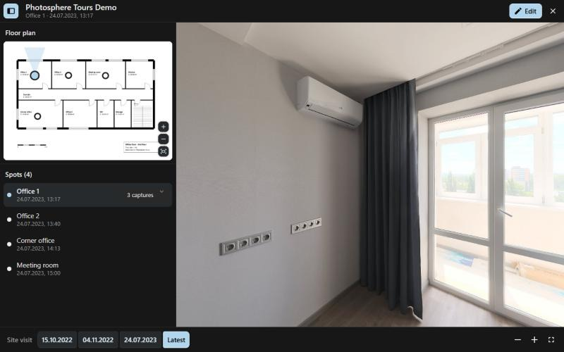
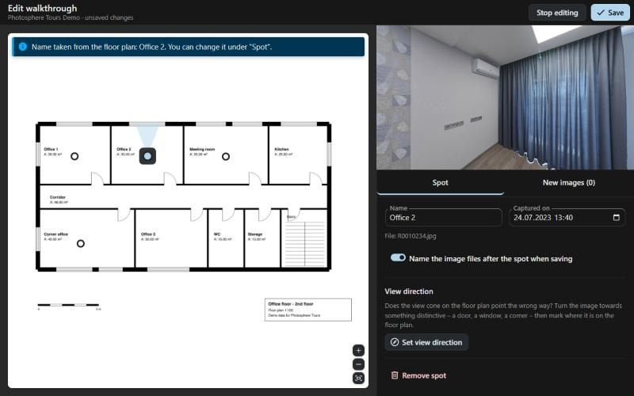
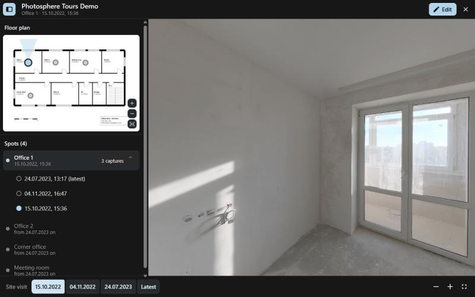
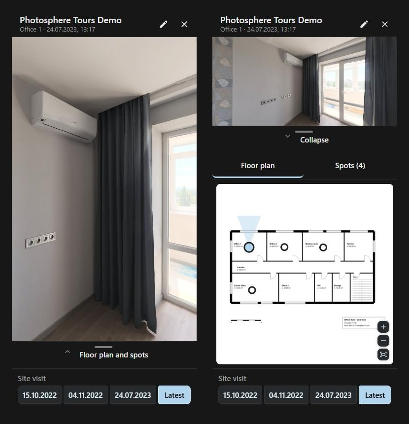

# Photosphere Tours

Turn a folder of 360° panoramas into a walkthrough on a floor plan, right inside
Nextcloud: see where each picture was taken and move from place to place – for a home,
an office, a venue, an exhibition or any other place you want to show or keep on
record. Built on [Photo Sphere Viewer](https://photo-sphere-viewer.js.org/).



## Features

### Create a walkthrough in a minute

- Put the 360° images and a floor plan (PDF, PNG, JPG, WebP or SVG) into a folder.
  A bar above the file list offers **Create 360° walkthrough**. A single plan in the
  folder is taken right away; a PDF is converted once.
- Pick an image and click its place on the plan. For PDF plans with text the room name
  from the plan is offered – take it over, correct it or give your own name. The
  capture date comes from the camera.
- Set the view direction once, so the cone on the plan shows where you are looking.
- Rename spots in the list – the image files can follow the new name.



### See how places change

Add later captures of the same spot. **Visits** show every spot as it was on a
given day; spots with several captures let you pick one. Spots that did not exist
yet on that day are greyed out.



### Walk through it – on any device

Panorama next to the floor plan and the spot list. The plan zooms and pans, the side
bar can be resized or hidden, everything works with keyboard, mouse, touch and on
phones. Share the folder by link and guests see the walkthrough read-only.



### Your data stays plain files

Everything is stored in one file, `360-Rundgang.json`, next to the images – no
database, no server component. It syncs with the desktop client, moves with its
folder and is versioned like any other file. Removing a spot never deletes an image.

## Installation

The first release for the Nextcloud App Store is being prepared; once it is out,
install **Photosphere Tours** under *Apps → Multimedia*. Until then, build the tarball
with `make appstore` and unpack it into `custom_apps/`. Requires Nextcloud 33 or 34
and a browser with WebGL 2. Languages: English, German.

Fork of [files_photospheres](https://github.com/nextcloud/files_photospheres) by
Robin Windey, reduced to walkthroughs. Both apps can run side by side: single
panoramas keep opening in files_photospheres (or the Viewer app), this app only
reacts to walkthrough files.

## How it works

A walkthrough is one file, `360-Rundgang.json`, in a folder of panoramas.
Clicking it opens the panorama together with a side bar: the floor plan with all
spots and a list of the spots. Clicking a spot goes there, the view direction is
kept. *Visit* at the bottom shows every spot as it was on one day; spots with
several captures show *n captures* in the list and unfold to pick one. The floor
plan zooms (buttons, wheel, two fingers) and pans by dragging. The side bar can be
resized or hidden; on phones it is a bottom sheet.

```json
{
  "version": 1,
  "title": "Ground floor",
  "plan": "../Floor plans/Ground floor.png",
  "spots": [
    { "name": "Hall", "x": 0.41, "y": 0.29,
      "captures": [
        { "file": "001_2024-08-14_1602_Hall.jpg", "date": "2024-08-14T16:02", "yaw": 0 },
        { "file": "later/2025-09-24_1031_Hall.jpg", "date": "2025-09-24T10:31", "yaw": 12.5 } ] }
  ]
}
```

- `plan` and `file` are relative to the folder of the JSON file.
- `x`/`y` are normalised plan coordinates (0–1, origin top left).
- `yaw` (degrees) is the raw panorama direction that looks towards the top of the
  plan. It is set in the editor by clicking on the plan beside the selected spot.

There is no database and no server-side code beyond loading the script: the file
syncs with the desktop client, moves with its folder and works through public
share links.

## Usage

- **Create:** put the 360° images and a floor plan (PDF, PNG, JPG, WebP or SVG) into
  one folder. A bar above the file list offers *Create 360° walkthrough* (also in the
  folder's menu: *Open as 360° walkthrough*, and under *New*). With one floor plan
  in the folder it is taken right away, otherwise you pick it. A PDF plan is turned
  into a PNG next to it. Only the folder itself counts – subfolders (for example
  compressed copies) are ignored.
- **Open:** the bar above the file list (*Open walkthrough*), the folder's menu, or a
  click on `360-Rundgang.json`.
- **Edit** (needs write permission): *Edit* opens the editor – floor plan on the
  left, panorama and one panel with the selected *Spot*, the floor plan file and the
  *New images* on the right; drag the border between them to share the width. On
  the plan, dragging pans, a short click on a spot selects it.
  *New images* lists images of the folder that belong to no spot yet; a picked image
  shows in the panorama at once – click on the plan for a new spot, or on a spot to
  add it as another capture. With
  a PDF plan, the room name of the nearest room stamp is offered: *Use it* puts it into
  the name field, where it can still be corrected; *Use all suggestions* does it for
  every spot that still has the camera's file name. Nothing is renamed before that.
  Drag spots to move them (or use the arrow keys).
  *View direction*: with a spot selected, turn the panorama towards something you can
  find on the plan and click that place – the cone turns there (*Undo* in the note
  takes it back). Removing only drops images from the walkthrough, files
  are never deleted. The capture date comes from the file name, else from the
  camera's EXIF data. When a newer floor plan appears in the folder the editor
  offers to switch; *Change floor plan* does it by hand.
- **Rename:** the pencil next to a spot in the list renames it and saves right away;
  the spot's image files are renamed too (`2024-08-14_1602_<name>.jpg`). In the
  editor this is a switch under *Spot*.
- **Keyboard:** Tab through header, plan, spot list and visits; arrow keys turn
  the focused panorama (+/− zoom) and move the focused spot in the editor; Escape
  leaves modes, then the editor, then the walkthrough.
- **Share:** share the folder by link. Guests see the walkthrough read-only.

## Development

```bash
npm ci
npm test          # vitest
npm run build     # webpack → js/
make appstore     # build/artifacts/appstore/photosphere_tours.tar.gz
```

Supported: Nextcloud 33 and 34, desktop and phone. Needs a browser with WebGL 2.

## Screenshots and demo data

The screenshots in `screenshots/` show a demo walkthrough: panoramas from
[Poly Haven](https://polyhaven.com) (CC0) and a floor plan drawn for the purpose.
`tools/demo/` recreates the data.

## License

AGPL-3.0-or-later, see [COPYING](COPYING). Bundled libraries and their licenses:
[THIRD-PARTY-NOTICES.md](THIRD-PARTY-NOTICES.md).
